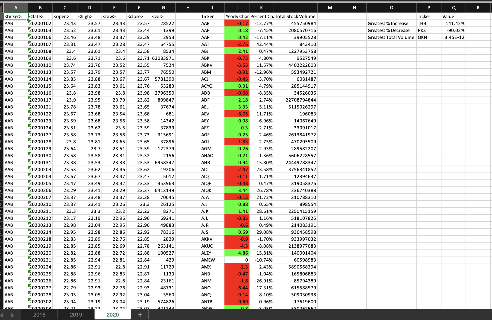

# VBA Challenge
This challenge was to create a script that loops through sctock data for each year in the dataset and outputs the following:

* The ticker symbol.
* Yearly change from opening price at the beginning of a given year to the closing price at the end of that year.
* The percent change from opening price at the beginning of a given year to the closing price at the end of that year.
* The total stock volume of the stock.

As a bonus, I created a table with the stock with the "Greatest % increase", "Greatest % decrease", and "Greatest total volume" for the year.

This repo contains:
* `vba_of_wallstreet.bas`: VBA code to perform analysis
* `screenshots directory`: screenshots of summary and bonus tables for each year
* `.gitignore`: ignores Excel files used to test scripts